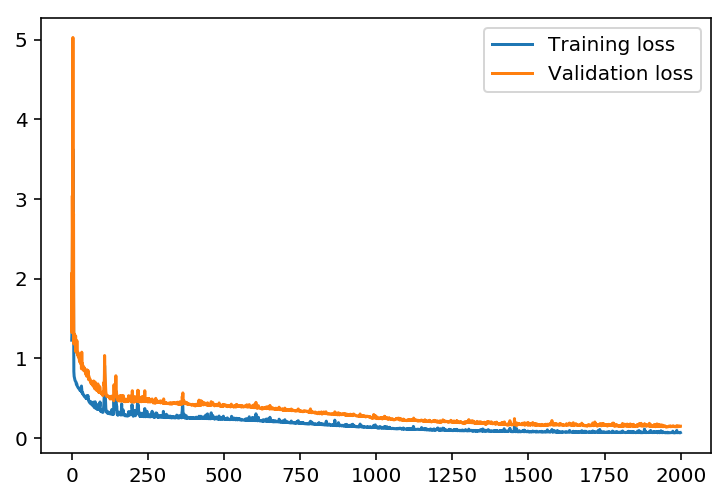
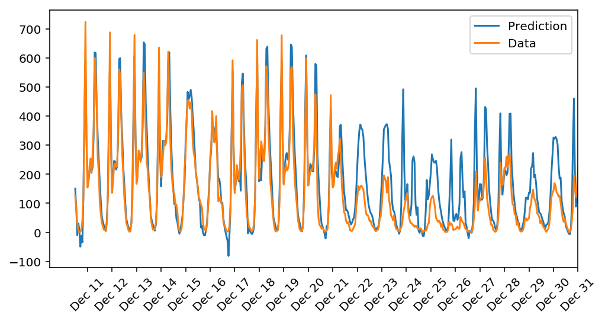

## Method

This project takes a first look at the mechanics inside a neural network - namely, a series of linear algebra operations mixed with nonlinear activation function application. The forward pass and backpropagation steps are manually implemented in [my_answers.py](my_answers.py) using standard numpy functions. The network implemented therein is used to train on, and subsequently predict, bike rental volume as a function of time. The pandas library is used to read in the data formatted as a CSV file.

## Results

The results are found in the [Your_first_neural_network.ipynb](Your_first_neural_network.ipynb) notebook and duplicated here.

The training and validation losses are plotted as a function of iterations.

After training, predictions using an independent test dataset are plotted here, along with the truth.

