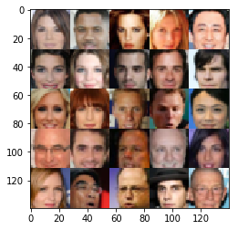
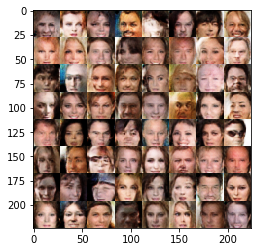

These exercises were cloned from this [Udacity github location](https://github.com/udacity/deep-learning/tree/master/face_generation). 

## Method

In this project I used a Deep Convolutional Generative Adversarial Network (DCGAN) to generate new images.
Briefly, a GAN works by pitting two neural networks against each other: a generator and a discriminator.

The generator generates an image from an input noise vector.
The discriminator takes in images, both from the generator and from a training set of real images, and classifies whether the image is real or generated.
During training, the output of the discriminator is fed back into the generator in order to indicate whether the generator has sufficiently "fooled" the discriminator, and if not, in what direction it has to go to accomplish that task.
The discriminator is also being trained as a classifier by telling it whether the image it classified was real or generated, so that it can get better at not being fooled.
The goal in the end is to make a generative network that makes realistic images.

In the [dlnd_face_generation_sub2.ipynb](dlnd_face_generation_sub2.ipynb) notebook one can observe my implementations of 
1. both the generator and the discriminator using Tensorflow, 
1. the calculation of the loss,
1. the calculation of the discriminator and generator training optimizations,
1. the training function, and
1. the hyperparameter values.

In this project the DCGAN is first trained using the easier MNIST dataset of white handwritten digits on a black background.
Subsequently the more complex [CelebFaces Attributes Dataset](http://mmlab.ie.cuhk.edu.hk/projects/CelebA.html), containing color pictures of celebrity faces, is used.

## Results

The full project including results are found in the [dlnd_face_generation_sub2.ipynb](dlnd_face_generation_sub2.ipynb) notebook.

Below is a comparison of a sample of real faces (left) and the last sample from the training of generated faces (right).

