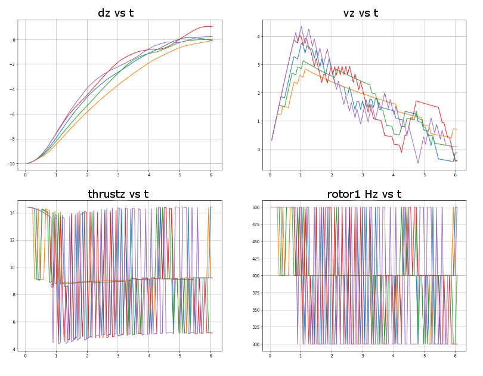
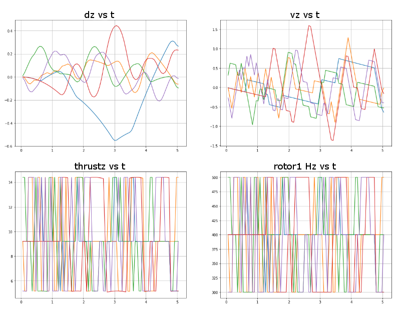

Most of these project files were originally cloned from this [Udacity github repository](https://github.com/udacity/RL-Quadcopter-2). 
Udacity's README file is duplicated [here](README_Udacity.md).

## Method

This project explores the concepts of Reinforcement Learning (RL). Deep RL is merely RL using deep neural networks.
These concepts are used to teach a (simulated) quadrotor drone how to successfully complete a flying task.

At the most basic level, RL is based on a view of the world as shown below.

There is the agent (the software program) and the environment that it operates in. The agent is in state _S_ at time _t_, and takes an action _A_, which affects the environment. The environment in turn affects the agent, determining its new state _S_ at the next time step. In addition the agent receives a "reward" _R_, and then the process continues. The goal of RL is for the agent software to "learn" how to navigate the environment by choosing actions that maximize the reward it expects to receive.

In this project, the agent is software that controls the speed of a quadcopter's four rotors. The environment is a simulated world that determines forces and torques on the quadcopter, based on the rotor speeds, that change its pose (x,y,z,pitch,roll - collectively the state information, yaw isn't simulated since the drone is four-fold symmetric about the vertical axis). The goal for the student is to write an effective reward function by which the agent can learn to achieve a flight task, in this case, take off and reach a hover altitude.

There are multiple RL algorithms depending on the agent design. Most revolve around the use of either a _value function_, or a _policy_, or both. A value function determines the value of each possible state based on the expected cumulative reward (since that is what we're maximizing) to be gained by going to that state. A policy is a set of rules on what actions to take given the current state and inputs from the environment. Policy methods aim at optimizing the existing policy as various states and rewards are encountered, without pre-calculating a value function.

Two different types of RL algorithms were explored in this project: [Deep Q-Learning (DQL)](https://en.wikipedia.org/wiki/Q-learning) and [Deep Deterministic Policy Gradients (DDPG)](https://arxiv.org/abs/1509.02971). The former is a policy-based method that discretizes the action space (possible actions are discrete and countable), whereas the latter allows for continuous action variables (e.g., continuous rotor speeds) and uses both a value function and a policy, the so-called "actor-critic method". The DDPG method used Keras to build and train the networks, whereas the DQL method used Tensorflow.

The table below describes the files associated with this project and their function.

Notes | File | Usage
-- |  --- | ---
[1] | [Quadcopter_Project.ipynb](Quadcopter_Project.ipynb) | Contains initial exercises, and a description of my experiences and design decisions under the "Reflections" section
[1] | [Quadcopter_Project_DDPG.ipynb](Quadcopter_Project_DDPG.ipynb) | main notebook for the DDPG implementation, where the student implements the training and plotting functions
[1] | [Quadcopter_Project_DQL.ipynb](Quadcopter_Project_DQL.ipynb) | main notebook for the DQL implementation 
[1] | [task_AC.py](task_AC.py) |  All task files implement agent support functions init, step, reset and reward. The step function also steps the physics simulation. This file implements the agent task using the Actor-Critic (DDPG) method, independent rotor freedom.
[1] | [task_AC_nopitchandroll.py](task_AC_nopitchandroll.py) | same as above, but locking all rotors to the same speed 
[1] | [task_DQL_withpitchandroll.py](task_DQL_withpitchandroll.py) |   implementation of the agent task using the DQL method, independent rotor freedom 
[1] | [task_DQL_nopitchroll.py](task_DQL_nopitchroll.py) | same as above, but locking all rotors to the same speed 
[2] | [physics_sim.py](physics_sim.py) | code implementing the environment including drone flight characteristics and laws of physics. Normally not touched by the student, but it contained a bug I had to fix, and in order to do what I wanted I had to enhance it's capability 
NA | [agents](agents) | folder containing agent implementations. Each agent implements init, reset, act, step, and learn functions
[1] | [agents/DDPGagent.py](agents/DDPGagent.py) | implementation of the agent in the DDPG method 
[1] | [agents/DQLagent.py](agents/DQLagent.py) | implementation of the agent in the DQL method 
[1] | [agents/DQLnetwork.py](agents/DQLnetwork.py) | implementation of the neural network for the DQLagent
[2] | [agents/OUNoise.py](agents/OUNoise.py) | implementation of Ornstein-Uhlenbeck noise for the DDPG method 
[1] | [agents/actor_orig.py](agents/actor_orig.py) | implementation of the actor NN in the DDPG method with 32x64x32 hidden layers
[1] | [agents/actor_128x256x128.py](agents/actor_128x256x128.py) | implementation of the actor NN in the DDPG method with 128x256x128 hidden layers
[1] | [agents/critic_orig.py](agents/critic_orig.py) | implementation of the critic dual NNs in the DDPG method with 32x64 hidden layers
[1] | [agents/critic_128x256.py](agents/critic_128x256.py) | implementation of the critic dual NNs in the DDPG method with 128x256 hidden layers
[2] | [agents/replaybuffer.py](agents/replaybuffer.py) | used for batch training in both methods

- [1] Implemented by the student using supplied sample/skeleton code
- [2] Supplied

The chief difficulty I encountered in this project was the extreme sensitivity of the simulated drone to unequal rotor speeds (even as low as 1 Hz difference), which caused the drone to flip over and crash. I spent days trying to solve this problem, but no amount of reward function or NN architecture tweaking would fix it. The network simply wouldn't learn to counter changes in angle.

This having been my first encounter with the Actor-Critic method, which was my first attempted method, I became skeptical of this approach. Since I had seen a previous example of a real-time control system successfully solved with a deep Q-learning network, I chose to switch to that method by discretizing the rotor speeds into low, medium and high. Still the drone would flip over.

Finally I had to reduce the action variables to a single discretized rotor speed control that all rotors were locked to. This solved the problem, but also restricted the drone to vertical motion exclusively. As a result the network was able to learn two different flight tasks: first, to take off, climb and reach a specified altitude, and second, to hover at an altitude. These tasks were not merged into a single implementation due to their different reward functions and time constraints.

A more detailed description of my experiences and design decisions can be found in [this notebook](Quadcopter_Project.ipynb).

## Results

The following graphs show the successful completion of the takeoff-reach altitude task using the DQL implementation. Each colored line represents a separate training episode. Five such episodes near the end of training were selected for plotting.

Note that over six seconds of simulation the dz vs t graph shows the drone taking off, climbing and finally reaching the target altitude, which marks 0 on the graph, and is 10 meters above the ground where it started. Note also that the thrustz and rotor speeds toggle between three values, and that for most of the first second the thrustz is on average higher than for the rest of the period, since it is taking off, and the dz and vz plots show the drone accelerating upward.

The following graphs show the successful completion of the hover task using the DQL implementation. The drone starts at altitude and is tasked with remaining at altitude, this time for five seconds. Once again five episode are taken from near the end of the training.

Note that over the time period the rotors successfully toggle between low, medium and high values in order to maintain altitude to within about half of a meter or less.

Plots for the DDPG implementation can be found in [this notebook](Quadcopter_Project_DDPG.ipynb)
